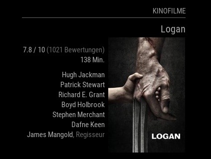

# MMM-MovieListings
Displays the top 20 movies that are currently in theaters around you. The list is fetched from [The Movie Database](https://themoviedb.org).
The module determines whether it's on the left or right side of the mirror and displays accordingly (image in poster mode mode will always be on the side of the mirror's edge):

[](https://MagicMirror.builders)
[](LICENSE)




## Install
`cd ~/MagicMirror/modules`

`git clone https://github.com/Tueti/MMM-MovieListings`

## Dependencies
None. Uses MagicMirror² builtin fetch

## Updates

### v1.1.1
- Fixed bug that ignored the language configuration
- Fixed changes in default values

### v1.1.0
- Removed the `list` option as the visual for it not very apealing.
- Fixed issue with `cast` which was not updating for each new movie passed in
- Changed and simplified the way in which movies were being fetched and displayed

### v1.0.0
- The Movie DB has made changes to the way in which they authenticate the different API used by the module. The API key now no longer supports all APi's. As such, the module has been updated to make use of the `API Read Access Token` instead.
- Have removed `request` and updated to makse use of the internal fetch module instead.

## Config
The entry in `config.js` can include the following options:

|Option|Description|Default|
|---|---|---|
|`header`|The header of the module|Kinofilme|
|`apiKey`|**required** Your API Read Access Token. Please insert the 'v3 (auth)' key here, not v4. Signup [here](https://www.themoviedb.org/account/signup), then get a key in your profile section -> api|_none_|
|`interface`|Defines how the module will be presented. Movies can either be shown as a poster with details or a simple list. User `poster` or `list` as values.|`poster`|
|`includeMoviePlot`|Determins whether a short plot discription will be shown or not. Set to either `true` or `false`|`false`|
|`maxPlotLength`|Sets the max length of the movie plot description. Only necessary if `includeMoviePlot` is set to `true`. Setting this value to `0` shows entire plot. NOTE: This might be a long text and mess with the layout.|`198`|
|`region`|The region you want to see the movie listing for. Insert a region as an [ISO 3166-1](https://en.wikipedia.org/wiki/ISO_3166-1_alpha-2) code (DE for Germany, US for United States, GB for United Kingdom, etc...) |`DE`|
|`language`|The language for the movie titles. Either a simple [ISO-639-1](https://en.wikipedia.org/wiki/List_of_ISO_639-1_codes) code (DE for Germany, EN for english, etc.) or a region specific language as in [ISO 3166-1](https://en.wikipedia.org/wiki/ISO_3166-1_alpha-2) (de-DE for German in Germany, pt-BR for Portugese in Brazil, etc.)|`de-DE`|
|`number_to_fetch`|The number of movies to fetch.|`20`|
|`pageChangeInterval`|Interval in milliseconds to change between movies`|`30 * 1000` = 30 seconds|
|`refreshInterval`|Interval in milliseconds to update movie list. Please take the [API documentation](https://developers.themoviedb.org/3/getting-started/request-rate-limiting) for rate limit into account |`1000 * 60 * 60 * 24` = Once a day|

## Example Config
Add the module to the modules array in the `config/config.js` file:
````javascript
{
		module: 'MMM-MovieListings',
		position: 'bottom_left',
		config: {
			apiKey: 'api_key_here',
			header: "Kinofilme",
			interface: "poster",
			includeMoviePlot: true,
			number_to_fetch: 20,
			maxPlotLength: 198,
			region: "DE",
			language: "de-DE",
			pageChangeInterval: 10 * 1000,
			refreshInterval: 1000 * 60 * 60 * 60 * 24
		}
},
````